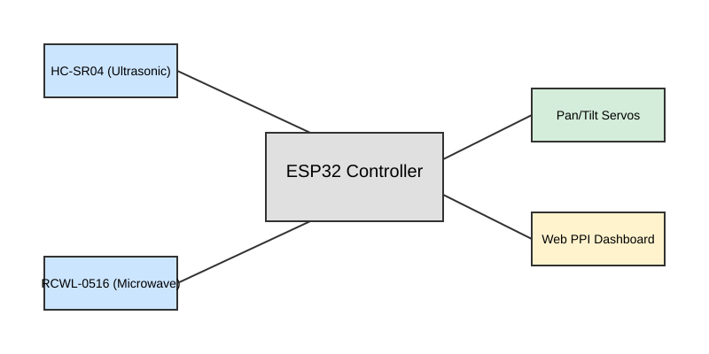

# Radar-Inspired PPI Target Tracking System

**ESP32-based educational sensing and visualization platform.**


## Overview
This repository contains the firmware and documentation for an educational, radar-inspired tracking system. Designed as an engineering demonstration, the project utilizes an ESP32 microcontroller, ultrasonic ranging (HC-SR04), and microwave motion detection (RCWL-0516) to scan an environment and visualize detected objects in real-time. 

Instead of relying on a physical LCD/OLED, the system hosts a high-performance **PPI (Plan Position Indicator)** visualization via a local web server and WebSockets, rendering the environment dynamically on any connected browser.

> **Disclaimer:** This project is an educational radar-inspired sensing and visualization system. It uses ultrasonic and microwave motion sensors to map distance and movement. It does *not* implement true electromagnetic radar, nor is it a weapon or surveillance system.

## Features
* **Continuous Sector Scanning:** Smooth, algorithmically-controlled servo sweeping.
* **Sensor Fusion:** Correlates omnidirectional motion (RCWL-0516) with directional ranging (HC-SR04).
* **Kalman Filtering:** Implements a 1D Kalman filter to smooth noisy ultrasonic distance readings.
* **Real-Time PPI Visualization:** Serves a dynamic HTML Canvas dashboard natively from the ESP32.
* **Target Persistence:** Visual blips fade dynamically to represent historical sweeps.
* **Voice Alerts:** Utilizes the browser's native Web Speech API for automated Text-to-Speech (TTS) alerts when targets enter a defined perimeter.

## System Architecture
The signal and logic flow is structured as follows:

```
Sensors (HC-SR04 & RCWL-0516)
   ↓
ESP32 (Data Acquisition & Kalman Filtering)
   ↓
Distance Measurement & Angle Association
   ↓
Target Detection Logic
   ↓
WebSockets Serialization (JSON)
   ↓
Web Client (PPI Visualization & TTS Audio)
   ↓
Servo Control Output (Continuous Sweeping)
```



## Hardware Requirements
| Component | Quantity | Purpose |
| :--- | :--- | :--- |
| ESP32 (38-Pin) | 1 | Main controller, Web Server, Logic |
| HC-SR04 | 1 | Distance measurement |
| RCWL-0516 | 1 | Microwave motion confirmation |
| SG90 Servo | 3 | Scanning mechanism (Pan/Tilt) |
| CA6009 Boost Converter | 1 | Power regulation for motors |
| 18650 Battery | 1 | System power |

See `hardware/bom.csv` and `hardware/pinout.md` for extended details.

### Wiring & Power Guidelines

* **ESP32:** Powered via USB during development/monitoring.
* **Servos & Sensors:** Powered explicitly by the CA6009 Boost Converter outputting 5.0V.
* **CRITICAL:** Do NOT power the SG90 servos directly from the ESP32 5V/3V3 pins. They will draw excessive current and trigger brownout resets. Ensure the ESP32 `GND` and the Boost Converter `GND` are tied together.

## Working Principle
1. **Sweeping:** The Pan servo iterates smoothly between configured angular limits (e.g., 20° to 160°).
2. **Measurement:** At 50ms intervals, the HC-SR04 emits an ultrasonic pulse.
3. **Filtering:** The raw distance is processed via a 1D Kalman filter to reduce environmental noise.
4. **Association:** The filtered distance is mapped to the exact servo angle at the time of measurement.
5. **Detection:** If distance is within the threshold (e.g., < 150cm) and the RCWL-0516 confirms motion, a threat flag is raised.
6. **Transmission:** A JSON payload containing `{state, angle, distance}` is broadcast via WebSockets at 20Hz.
7. **Visualization:** The web client plots the polar coordinates on the PPI canvas.

## Mathematical Model
The system maps polar coordinates $(r, 	heta)$ to Cartesian coordinates $(x, y)$ for HTML Canvas rendering:
* $x = r 	imes \cos(180^\circ - 	heta)$
* $y = r 	imes \sin(180^\circ - 	heta)$

*(Note: Angles are inverted based on physical servo mounting orientation and canvas origin).*

## Software Architecture


* **Firmware Structure:** Written in C++ using the PlatformIO environment.
* **Non-Blocking Logic:** Servo sweeps, sensor polling, and web server execution run concurrently using `millis()` timing loops.
* **Communication:** `ESPAsyncWebServer` handles HTTP GET for the UI, while `AsyncWebSocket` pushes rapid telemetry.

## Installation & Configuration
### PlatformIO Setup
1. Clone the repository: `git clone https://github.com/devakshay07/radar-inspired-ppi-target-tracking-system.git`
2. Open the project folder in **VS Code** with the **PlatformIO** extension.
3. Configure your WiFi credentials in `src/main.cpp`:
   ```cpp
   const char* ssid = "SmartSentry_AP";
   const char* password = "YOUR_WIFI_PASSWORD"; // Update this
   ```
4. Click **Build** and **Upload**.

### Libraries
PlatformIO automatically handles library dependencies via `platformio.ini`. Libraries used:
* `madhephaestus/ESP32Servo`
* `bblanchon/ArduinoJson`
* `mathieucarbou/ESPAsyncWebServer`

## Calibration
* **Servo Center:** Mount the HC-SR04 to the servo spline when the servo is commanded to exactly `90°`.
* **Angular Limits:** Update `currentPanAngle` constraints in the sweep logic to prevent mechanical binding.
* **Filtering:** Adjust the Process Noise (`Q`) and Measurement Noise (`R`) in `KalmanFilter.h` based on acoustic reflection in your environment.

## Testing & Troubleshooting
* **Sensor Accuracy:** Validate HC-SR04 readings via the Serial Monitor (`115200` baud) using a tape measure at 50cm, 100cm, and 200cm.
* **Servo Jitter:** If servos twitch erratically, verify common ground and ensure the battery is fully charged (step-up converters require sufficient input current).
* **Web UI Not Updating:** Ensure your client device is connected to the ESP32's Access Point (`SmartSentry_AP`) and the IP `192.168.4.1` is reachable.

## Limitations
* **Resolution:** Ultrasonic beams have a wide cone (~15°). Pinpoint angular accuracy is physically limited compared to LiDAR or electromagnetic radar.
* **Interference:** The RCWL-0516 microwave sensor penetrates walls and may detect human movement behind the sensor array.
* **Scan Speed:** Mechanical inertia limits the sweep rate; rapid sweeping distorts the ultrasonic return echo.

## Safety
* **Current Draw:** Do not stall the servos. Stalled SG90s can pull >700mA each, posing a thermal risk to cheap step-up converters.
* **Batteries:** Use protected 18650 cells. Ensure the CA6009 is tuned to exactly 5.0V *before* connecting the sensors/servos.

## Future Improvements
* Integration of TF-Luna LiDAR for precise angular resolution.
* Multi-sensor fusion (ESP32-CAM) for visual target confirmation.
* Extended multi-target tracking algorithms (clustering).
* MQTT integration for remote IoT logging.

## License
MIT License. See `LICENSE` for details.
