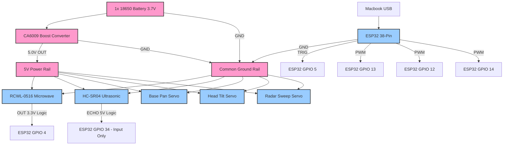

# Circuit Diagram

**CRITICAL NOTES:**
1. The ESP32 is powered via the Mac's USB port.
2. The Servos and Sensors are powered by the CA6009 Boost Converter.
3. **MUST DO:** You must connect the Ground (GND) of the ESP32 to the Ground (GND) of the CA6009 output. If you do not tie the grounds together, the PWM signals will float and the servos will spasm violently.
