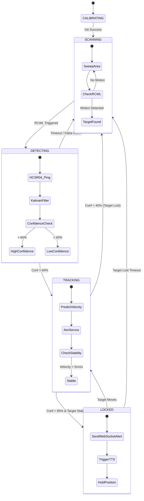

# System Flowchart

```mermaid
stateDiagram-v2
    [*] --> CALIBRATING
    
    CALIBRATING --> SCANNING : Init Success

    state SCANNING {
        [*] --> SweepArea
        SweepArea --> CheckRCWL
        CheckRCWL --> TargetFound : Motion Detected
        CheckRCWL --> SweepArea : No Motion
    }

    SCANNING --> DETECTING : RCWL Triggered

    state DETECTING {
        [*] --> HCSR04_Ping
        HCSR04_Ping --> KalmanFilter
        KalmanFilter --> ConfidenceCheck
        ConfidenceCheck --> HighConfidence : > 60%
        ConfidenceCheck --> LowConfidence : < 40%
    }

    DETECTING --> TRACKING : Conf > 60%
    DETECTING --> SCANNING : Timeout / False Alarm

    state TRACKING {
        [*] --> PredictVelocity
        PredictVelocity --> AimServos
        AimServos --> CheckStability
        CheckStability --> Stable : Velocity < 5cm/s
    }

    TRACKING --> LOCKED : Conf > 85% & Target Stable
    TRACKING --> SCANNING : Conf < 40% (Target Lost)

    state LOCKED {
        [*] --> SendWebSocketAlert
        SendWebSocketAlert --> TriggerTTS
        TriggerTTS --> HoldPosition
    }

    LOCKED --> TRACKING : Target Moves
    LOCKED --> SCANNING : Target Lost Timeout
```
